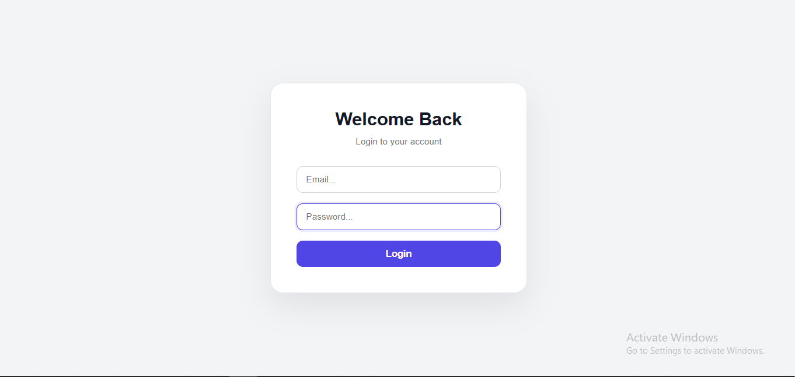
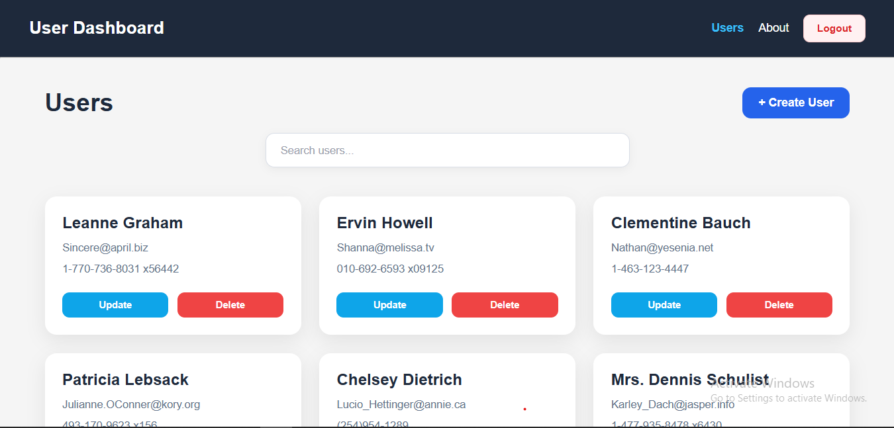
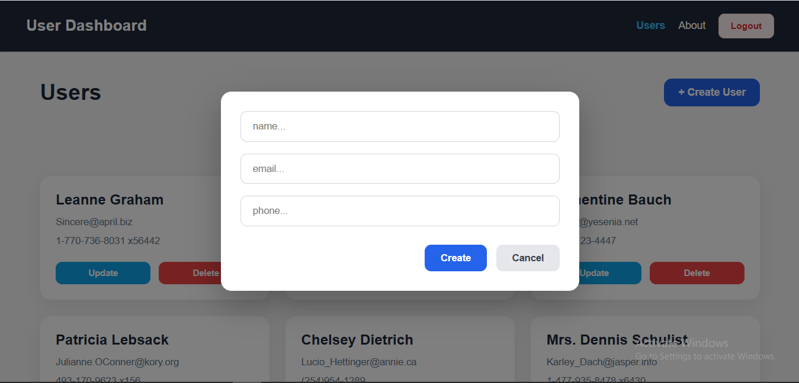
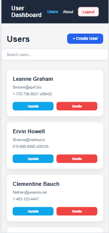

# User Management Dashboard

A modern and responsive user management dashboard built with **React 19** and **Vite**.

The application provides a clean interface for managing users with CRUD operations, search, pagination, form validation, authentication, protected routes, error handling, and reusable API logic.

## 🚀 Live Demo

**[View Live Demo](https://reza7mohammadi.github.io/user-management-dashboard/)**

## 📸 Screenshots

### Login



### Users Dashboard



### User Form



### Responsive Design



---

## ✨ Features

* **CRUD Operations** — Create, update, and delete users
* **Search** — Find users by name or email
* **Pagination** — Browse users across multiple pages
* **Form Validation** — Validation with React Hook Form and Yup
* **Authentication** — Login, logout, and protected routes
* **Custom Hook** — Reusable hook for user and API operations
* **Responsive Design** — Mobile-friendly layouts and adaptive components
* **Error Handling** — Handles API and application errors
* **Reusable Components** — Modular and maintainable component structure

---

## 🛠️ Tech Stack

* **React 19**
* **Vite**
* **React Router DOM**
* **Axios**
* **React Hook Form**
* **Yup**
* **Hook Form Resolvers**
* **ESLint**

---

## 🔐 Authentication

The application includes an authentication flow with:

* Login functionality
* Logout functionality
* Protected routes
* Authentication-aware navigation

Protected pages are only accessible after successful authentication.

---

## 🌐 API Integration

API requests are handled using **Axios** and organized through a reusable custom hook.

The user-related API logic is separated from the UI components to keep the application structure clean and maintainable.

Main API functionality includes:

* Fetching users
* Creating users
* Updating users
* Deleting users
* Handling API errors

---

## 🔎 Search & Pagination

The Users page provides search functionality for finding users by:

* Name
* Email

Pagination allows users to navigate through multiple pages of user data instead of displaying all records at once.

---

## 📱 Responsive Design

The dashboard is designed to work across different screen sizes.

The layout and components adapt to provide a better experience on:

* Desktop
* Tablet
* Mobile

---

## 📁 Project Structure

```text
src/
├── components/
│   ├── Layout/
│   ├── LoginForm/
│   ├── ProtectedRoute/
│   ├── UserCard/
│   └── UserForm/
├── hooks/
│   └── useUsers.js
├── pages/
│   ├── About.jsx
│   ├── Login.jsx
│   ├── Notfound.jsx
│   └── Users.jsx
├── styles/
├── validation/
│   ├── loginSchema.js
│   └── userSchema.js
├── App.jsx
└── main.jsx
```

---

## ⚙️ Installation

Clone the repository:

```bash
git clone https://github.com/Reza7Mohammadi/user-management-dashboard.git
```

Navigate to the project directory:

```bash
cd user-management-dashboard
```

Install dependencies:

```bash
npm install
```

---

## 💻 Development

Start the development server:

```bash
npm run dev
```

Then open the local URL provided by Vite in your browser.

---

## 📦 Production Build

Create a production build:

```bash
npm run build
```

Preview the production build:

```bash
npm run preview
```

---

## 📜 Available Scripts

```bash
npm run dev
npm run build
npm run lint
npm run preview
```

---

## 🚀 Deployment

The project is automatically deployed to **GitHub Pages** using **GitHub Actions**.

Every push to the `main` branch triggers the deployment workflow.

**Live Website:**

https://reza7mohammadi.github.io/user-management-dashboard/

---

## 🏷️ Version

Current stable release:

**v1.0.0**

---

## 🔗 Repository

[GitHub Repository](https://github.com/Reza7Mohammadi/user-management-dashboard)

---

## 👨‍💻 Author

**Reza Mohammadi**

[GitHub Profile](https://github.com/Reza7Mohammadi)


